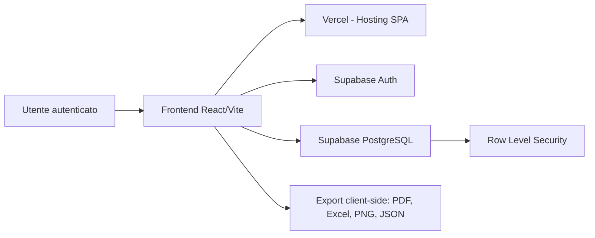
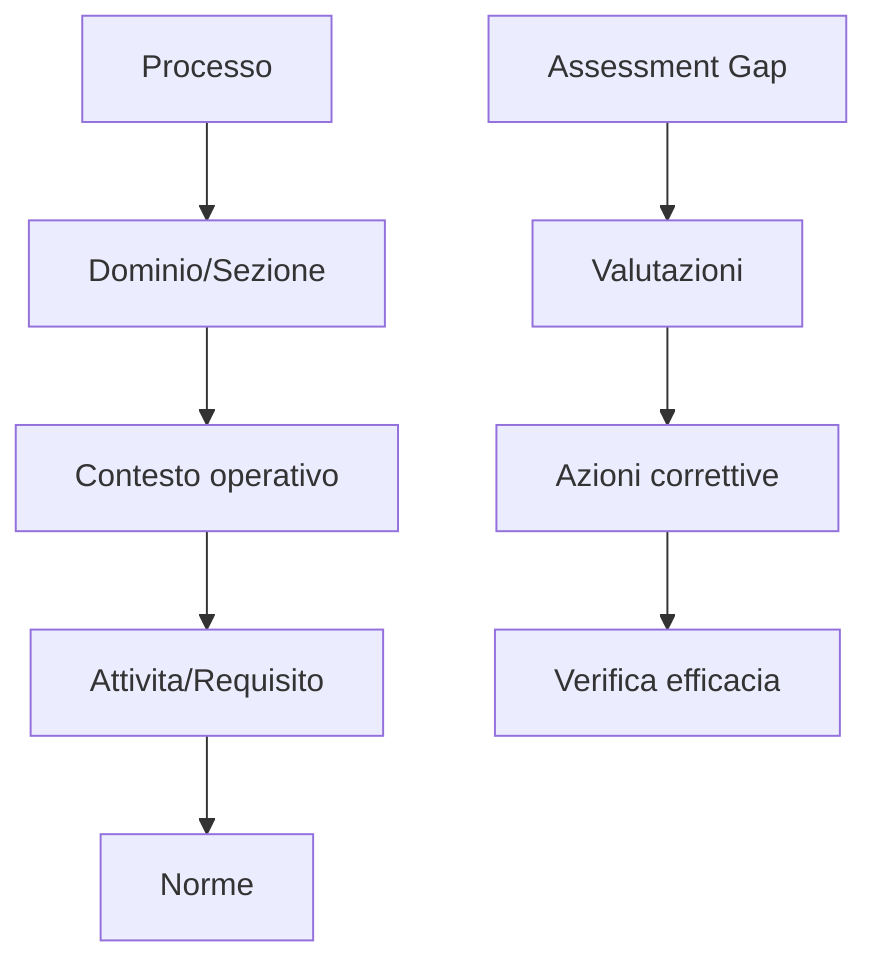

# Documento tecnico-descrittivo dell'applicazione PhaRMA T

**Piattaforma web per FMEA, Root Cause Analysis e Gap Analysis in farmacia ospedaliera e rischio clinico**  
**Versione documento:** 1.0  
**Data:** 10 giugno 2026  
**Proponente:** Dott. Daniele Leonardi Vinci  
**Area di riferimento:** Rischio clinico, farmacia ospedaliera, qualita e sicurezza dei processi sanitari

---

## 1. Executive Summary

PhaRMA T e una web app progettata per supportare, in modo strutturato e documentabile, attivita di analisi del rischio clinico e dei processi in ambito sanitario, con particolare riferimento alla farmacia ospedaliera.

L'applicazione integra tre moduli metodologici principali:

- **FMEA**, per l'analisi proattiva dei rischi di processo;
- **RCA**, per l'analisi reattiva di eventi, non conformita o near miss;
- **Gap Analysis**, per la valutazione strutturata di processi, requisiti, norme e azioni correttive.

L'obiettivo non e sostituire il giudizio professionale, ne orientare decisioni cliniche individuali, ma fornire uno strumento digitale per:

- standardizzare la raccolta delle informazioni;
- guidare workflow metodologici complessi;
- produrre report documentali;
- favorire formazione, esercitazione e confronto tra professionisti;
- supportare gruppi di lavoro e progettualita SIFO in ambito rischio clinico.

L'app e attualmente sviluppata come **single page application** frontend-first, basata su React, TypeScript, Vite, Tailwind CSS, Supabase e Vercel. Non prevede un backend custom proprietario: autenticazione, database e policy di accesso sono gestiti da Supabase, mentre il frontend e distribuito tramite Vercel.

La proposta progettuale e coerente con il mandato 2025-2028 dell'Area Scientifica Culturale Rischio Clinico SIFO. Si propone una durata progettuale fino al termine del mandato, con possibilita di proroga o istituzionalizzazione in base agli esiti del pilota, al valore formativo riscontrato e alla sostenibilita tecnico-organizzativa.

Raccomandazione preliminare: **procedere con un pilota controllato**, inizialmente su dati simulati, anonimi o non identificativi, con successiva valutazione da parte dei referenti SIFO, ICT e privacy in caso di estensione istituzionale.

---

## 2. Razionale del Progetto

La gestione del rischio clinico richiede strumenti capaci di integrare metodologie diverse, mantenendo coerenza tra analisi, azioni correttive, reportistica e tracciabilita documentale.

Nella pratica operativa, strumenti come FMEA, RCA e Gap Analysis vengono spesso gestiti tramite file separati, modelli locali, fogli Excel o documenti non interoperabili. Questo puo generare:

- duplicazione dei dati;
- difficolta nel mantenere versioni aggiornate;
- scarsa standardizzazione metodologica;
- perdita di tracciabilita tra analisi e azioni correttive;
- difficolta nel produrre report coerenti e confrontabili;
- limitata fruibilita in contesti formativi o di laboratorio.

PhaRMA T nasce per offrire una base digitale comune, modulare e scalabile, utile sia in ambito formativo sia in contesti progettuali o documentali relativi a processi di farmacia ospedaliera, qualita e rischio clinico.

Il valore atteso e duplice:

1. **Valore metodologico**, per guidare l'utente nell'applicazione coerente di strumenti consolidati.
2. **Valore documentale**, per produrre output strutturati e riutilizzabili in audit, formazione, revisione dei processi e condivisione interna.

---

## 3. Perimetro di Utilizzo Previsto

PhaRMA T e proposta come applicazione:

- formativa;
- metodologica;
- documentale;
- di supporto alla standardizzazione di analisi e report;
- non destinata a decisioni cliniche individuali.

L'utilizzo previsto riguarda dati:

- simulati;
- anonimizzati;
- aggregati;
- organizzativi;
- riferiti a processi, requisiti, eventi o criticita non riconducibili a persone fisiche identificate o identificabili.

L'applicazione **non e progettata per raccogliere dati identificativi di pazienti, operatori o altri soggetti coinvolti**, quali:

- nome e cognome;
- codice fiscale;
- numero di cartella clinica;
- recapiti;
- immagini;
- informazioni cliniche individuali direttamente riconducibili a una persona;
- elementi narrativi che rendano indirettamente identificabile un soggetto.

Gli output prodotti dall'app devono essere interpretati come strumenti di supporto metodologico e documentale. Ogni utilizzo in contesto reale, con dati non meramente simulati o formativi, dovra essere preceduto da valutazione dei referenti competenti, inclusi SIFO, ICT e figure privacy eventualmente coinvolte.

---

## 4. Utenti Target e Casi d'Uso

### 4.1 Utenti target

Gli utenti previsti sono:

- farmacisti ospedalieri;
- dirigenti farmacisti coinvolti in rischio clinico;
- risk manager;
- referenti qualita;
- componenti di gruppi di lavoro SIFO;
- docenti e tutor di laboratori formativi;
- discenti o partecipanti a corsi su FMEA, RCA e Gap Analysis;
- professionisti coinvolti nella revisione di processi sanitari.

### 4.2 Casi d'uso principali

| Caso d'uso | Descrizione |
|---|---|
| Laboratorio FMEA | Simulazione o analisi guidata di un processo, con identificazione rischi, scoring e azioni |
| Analisi RCA | Ricostruzione metodologica di evento o near miss attraverso Ishikawa e 5 Whys |
| Gap Analysis | Valutazione della conformita di processi rispetto a requisiti, norme o standard |
| Report documentale | Generazione di PDF/Excel/PNG per condivisione, audit o formazione |
| Monitoraggio azioni | Gestione di azioni correttive, stato, priorita, scadenze e verifica efficacia |
| Dashboard | Sintesi di assessment, criticita, azioni e stato di avanzamento |

---

## 5. Architettura Generale dell'Applicazione

PhaRMA T e una **single page application**. Il browser dell'utente carica il frontend da Vercel e comunica direttamente con Supabase tramite client JavaScript autenticato.

Non e presente un backend custom sviluppato ad hoc. Le funzioni di backend sono erogate da Supabase come servizio:

- autenticazione;
- gestione sessioni;
- database PostgreSQL;
- API automatiche;
- Row Level Security;
- audit log di autenticazione;
- policy di accesso ai dati.

Schema logico:

### 5.1 Frontend

Il frontend e realizzato in React e TypeScript. Gestisce:

- routing applicativo;
- schermate pubbliche e protette;
- dashboard;
- form;
- reportistica;
- export;
- visualizzazione grafici;
- interazione con Supabase.

### 5.2 Backend applicativo

Il backend e costituito dai servizi Supabase. Non sono presenti API custom, server Node.js o funzioni serverless proprietarie per la logica applicativa ordinaria.

### 5.3 Persistenza dati

La persistenza dati e gestita da Supabase PostgreSQL. I dati applicativi sono organizzati in tabelle dedicate ai moduli FMEA, RCA e Gap Analysis.

---

## 6. Stack Tecnologico

| Ambito | Tecnologia |
|---|---|
| Framework frontend | React 19 |
| Linguaggio | TypeScript |
| Build tool | Vite |
| Styling | Tailwind CSS v4 |
| Routing | react-router-dom |
| Autenticazione | Supabase Auth |
| Database | Supabase PostgreSQL |
| Sicurezza dati | Supabase Row Level Security |
| Grafici | Recharts |
| Icone | lucide-react |
| Export PDF | jsPDF, jspdf-autotable |
| Export Excel | xlsx |
| Export PNG | html-to-image, html2canvas |
| Hosting frontend | Vercel |
| Versionamento | Git/GitHub |
| Ambiente sviluppo | Visual Studio Code / ambiente locale Node.js |

---

## 7. Struttura del Codice e Componenti Applicativi

La struttura del progetto e organizzata per moduli, servizi e componenti riutilizzabili.

| Percorso | Funzione |
|---|---|
| `src/App.tsx` | Routing pubblico/protetto e definizione percorsi applicativi |
| `src/components/Layout.tsx` | Layout generale, sidebar e navigazione |
| `src/components/ui/*` | Mini design system: Button, Card, Badge, PageHeader, StatCard, EmptyState |
| `src/context/AuthContext.tsx` | Stato autenticazione, sessione utente Supabase |
| `src/lib/supabase.ts` | Inizializzazione client Supabase |
| `src/lib/labels.ts` | Helper label/colori condivisi |
| `src/lib/gapScoring.ts` | Calcoli puri per Gap Analysis |
| `src/lib/gapLimits.ts` | Limiti operativi e warning del modulo Gap |
| `src/lib/passwordPolicy.ts` | Policy password lato UI |
| `src/services/exportService.ts` | Export FMEA |
| `src/services/rcaExportService.ts` | Export RCA |
| `src/services/gapExportService.ts` | Export Gap Analysis |
| `src/services/gapService.ts` | Servizi lettura/scrittura Supabase per Gap Analysis |
| `src/services/gdprExport.ts` | Export complessivo dati utente |
| `src/pages/*` | Pagine generali e modulo FMEA |
| `src/pages/rca/*` | Pagine modulo RCA |
| `src/pages/gap/*` | Pagine modulo Gap Analysis |
| `supabase/migrations/*` | Migration SQL Gap e hardening RLS |

---

## 8. Modulo FMEA

Il modulo FMEA supporta l'analisi proattiva dei rischi.

### 8.1 Dashboard FMEA

Percorso: `/fmea/dashboard`

Funzionalita:

- riepilogo assessment;
- distribuzione rischi;
- stato azioni;
- indicatori sintetici;
- accesso rapido alle aree operative.

### 8.2 Elenco Assessment

Percorso: `/fmea/assessments`

Funzionalita:

- lista assessment FMEA;
- stato assessment;
- accesso al dettaglio;
- gestione archivio secondo workflow previsto;
- creazione nuovo assessment.

### 8.3 Creazione Assessment

Percorso: `/fmea/assessment/new`

Input principali:

- titolo;
- descrizione;
- area;
- processo;
- dati di contesto.

Output:

- nuovo assessment FMEA collegato all'utente autenticato.

### 8.4 Dettaglio Assessment

Percorso: `/fmea/assessment/:id`

Funzionalita:

- gestione rischi;
- scoring severita/probabilita/rilevabilita;
- calcolo RPN o indicatori equivalenti;
- gestione note;
- collegamento azioni correttive;
- report e grafici.

### 8.5 Matrice del Rischio

Componente: `RiskMatrix.tsx`

Funzionalita:

- rappresentazione 5x5 della distribuzione dei rischi;
- classificazione visiva per livello;
- export PNG.

### 8.6 Pareto

Componenti:

- `ParetoChart.tsx`
- `ParetoAnalysis.tsx`

Funzionalita:

- analisi dei rischi ordinati per contributo;
- visualizzazione barre e cumulata;
- supporto all'individuazione dei rischi prioritari.

### 8.7 Catalogo Rischi

Percorso: `/fmea/risks`

Funzionalita:

- consultazione catalogo base;
- gestione rischi personalizzati utente;
- riutilizzo rischi nei processi di assessment.

### 8.8 Azioni Correttive FMEA

Percorso: `/fmea/actions`

Funzionalita:

- elenco azioni;
- stato;
- responsabile;
- scadenza;
- aggiornamento avanzamento;
- collegamento al rischio.

### 8.9 Export FMEA

Formati:

- PDF;
- Excel;
- PNG per grafici.

---

## 9. Modulo RCA

Il modulo RCA supporta analisi reattive di eventi, near miss, non conformita o criticita operative.

### 9.1 Dashboard RCA

Percorso: `/rca/dashboard`

Funzionalita:

- totale assessment;
- distribuzione stati;
- distribuzione severita eventi;
- cause;
- root cause confermate;
- 5 Whys;
- azioni correttive;
- ultimi assessment.

### 9.2 Creazione Assessment RCA

Percorso: `/rca/assessment/new`

Input:

- titolo;
- descrizione;
- evento;
- severita;
- metodologia prevista.

La metodologia oggi privilegia il workflow combinato Ishikawa + 5 Whys, con possibilita di analisi Ishikawa.

### 9.3 Dettaglio RCA

Percorso: `/rca/assessment/:id`

Funzionalita:

- gestione evento;
- Ishikawa operativo;
- elenco cause;
- 5 Whys;
- classificazione root cause;
- azioni correttive;
- statistiche e report.

### 9.4 Ishikawa

Categorie previste:

- Organizzazione;
- Persone;
- Processi/Procedure;
- Tecnologie/Attrezzature;
- Ambiente;
- Farmaci/Materiali;
- Controlli/Monitoraggio.

Funzionalita:

- inserimento cause;
- classificazione per categoria;
- identificazione causa candidata;
- collegamento con 5 Whys e azioni correttive.

### 9.5 5 Whys

Funzionalita:

- catena causale progressiva;
- collegamento a causa candidata;
- esito metodologico:
  - candidata;
  - root cause confermata;
  - non confermata;
- note metodologiche.

### 9.6 Root Cause

Il workflow distingue:

- causa candidata;
- root cause confermata;
- causa non confermata.

Questa distinzione consente di separare l'ipotesi emersa da Ishikawa dall'esito metodologico della 5 Whys.

### 9.7 Azioni Correttive RCA

Percorsi:

- `/rca/actions`;
- tab azioni nel dettaglio assessment.

Funzionalita:

- creazione;
- modifica;
- eliminazione;
- stato:
  - pianificata;
  - in corso;
  - completata;
- priorita;
- responsabile;
- scadenza;
- tracciabilita completion date.

### 9.8 Report ed Export RCA

Formati:

- report web;
- PDF;
- Excel;
- PNG diagramma Ishikawa.

Il report include sezione metodologica RCA, diagramma Ishikawa, cause, 5 Whys, root cause, azioni correttive e monitoraggio.

---

## 10. Modulo Gap Analysis

Il modulo Gap Analysis e il piu articolato e consente di gestire valutazioni rispetto a processi, requisiti, norme e azioni.

### 10.1 Modello Concettuale

Il modello logico e:

Il database mantiene separati:

- libreria strutturale di processi, domini e attivita;
- dati specifici dell'assessment;
- azioni correttive.

### 10.2 Dashboard Gap

Percorso: `/gap/dashboard`

Funzionalita:

- assessment totali;
- compliance media;
- criticita;
- gap alta priorita;
- azioni aperte;
- azioni scadute;
- verifiche pending;
- grafici essenziali;
- liste operative.

### 10.3 Catalogo Processi

Percorso: `/gap/processes`

Funzionalita:

- creazione macro-processi;
- modifica;
- eliminazione;
- ricerca;
- accesso al dettaglio processo.

Il concetto di processo indica un macro-flusso valutabile, non una singola attivita.

### 10.4 Dettaglio Processo

Percorso: `/gap/process/:id`

Funzionalita:

- visualizzazione contesto processo;
- gestione Domini/Sezioni;
- gestione Attivita/Requisiti;
- codice automatico delle attivita basato sul codice del Dominio/Sezione;
- target atteso di riferimento obbligatorio per nuove attivita;
- associazione norme;
- creazione nuova norma direttamente da gestione norme.

### 10.5 Catalogo Norme

Percorso: `/gap/standards`

Funzionalita:

- creazione norme;
- modifica;
- eliminazione;
- ricerca;
- filtro per ente;
- filtro per cogenza;
- filtro per ambito di applicazione;
- vista lista completa;
- vista raggruppata per ambito.

Campi principali:

- codice;
- nome;
- versione;
- ente emittente;
- descrizione;
- URL;
- ambito di applicazione;
- norma cogente/non cogente;
- origine: libreria o solo assessment.

### 10.6 Creazione Assessment Gap

Percorsi:

- `/gap/assessments`;
- `/gap/assessment/new`.

Funzionalita:

- dati generali assessment;
- selezione processi;
- creazione automatica valutazioni per le attivita selezionate;
- snapshot di processo, dominio, codice e nome attivita;
- blocco creazione se non ci sono attivita;
- warning se l'assessment e molto grande.

### 10.7 Dettaglio Assessment Gap

Percorso: `/gap/assessment/:id`

Funzionalita:

- valutazione requisiti;
- filtri rapidi;
- aggiunta Dominio/Sezione;
- aggiunta Attivita/Requisito;
- distinzione tra elementi di libreria e "solo assessment";
- gestione norme;
- creazione norme contestuali;
- target atteso di riferimento in sola lettura;
- stato attuale;
- gap rilevato rispetto al target;
- stato conformita;
- priorita rischio;
- note.

### 10.8 Criticita

Nel modulo Gap, la criticita e definita da:

- non conformita;
- conformita parziale.

Il testo libero del campo gap non determina da solo una criticita operativa.

### 10.9 Azioni Correttive Gap

Funzionalita:

- creazione da tab azioni;
- creazione rapida contestuale dalla singola valutazione;
- modifica;
- eliminazione;
- stato;
- priorita;
- responsabile/i;
- date pianificate;
- avanzamento;
- fase;
- verifica efficacia;
- registro azioni globale read-only.

### 10.10 Verifica Efficacia

Per le azioni completate e previsto workflow di verifica:

- pending;
- effective;
- partially effective;
- ineffective.

In caso di inefficacia, l'azione torna in lavorazione e l'interfaccia suggerisce revisione o nuova azione.

### 10.11 Diagramma di GANNT

Il Diagramma di GANNT e utilizzato per visualizzare in modo read-only:

- azioni;
- date pianificate;
- stato;
- priorita;
- avanzamento;
- milestone di verifica.

Le barre sono colorate in base alla priorita, con progressione visiva dell'avanzamento.

### 10.12 Statistiche e Report Gap

Funzionalita:

- grafici compliance;
- distribuzione priorita;
- stato azioni;
- esiti verifica;
- Diagramma di GANNT;
- export PDF;
- export Excel;
- export PNG dei grafici.

---

## 11. Dashboard, Reportistica ed Export

PhaRMA T prevede reportistica differenziata per modulo.

| Modulo | Dashboard | PDF | Excel | PNG | JSON dati utente |
|---|---|---|---|---|---|
| FMEA | Si | Si | Si | Matrice/Pareto | Incluso export generale |
| RCA | Si | Si | Si | Ishikawa | Incluso export generale |
| Gap Analysis | Si | Si | Si | Grafici/GANNT | Incluso export generale |

Gli export sono generati prevalentemente lato client. Questo riduce la necessita di backend custom e semplifica il deploy.

### 11.1 Export dati utente

La funzione di export dati utente produce un file JSON comprensivo di:

- dati profilo/impostazioni;
- dati FMEA;
- dati RCA;
- dati Gap;
- metadati export;
- avvisi sul contenuto libero inserito dall'utente.

---

## 12. Sicurezza Applicativa e Protezione dei Dati

Le principali misure tecniche gia implementate sono:

- autenticazione Supabase;
- email verification obbligatoria;
- password policy rafforzata;
- routing protetto;
- Row Level Security su tutte le tabelle applicative;
- policy RLS rafforzate con ruolo `authenticated`;
- segregazione dati tramite `user_id`;
- audit log Supabase Auth;
- export dati utente;
- procedura di richiesta cancellazione account/dati;
- assenza di service role esposto lato frontend;
- comunicazione HTTPS tramite provider cloud.

### 12.1 Row Level Security

Le tabelle applicative risultano protette da Row Level Security. Le policy limitano accesso e modifica ai dati dell'utente autenticato, tramite:

- `user_id = auth.uid()` per tabelle con `user_id`;
- relazione padre-figlio per tabelle FMEA prive di `user_id` diretto.

### 12.2 Autenticazione

Sono stati configurati:

- registrazione via email;
- conferma email obbligatoria;
- password minima 12 caratteri;
- requisiti password: minuscole, maiuscole, numeri e simboli;
- blocco anonymous sign-in.

---

## 13. Perimetro Dati e Minimizzazione

L'applicazione e orientata a raccogliere dati funzionali all'analisi metodologica.

### 13.1 Dati previsti

- email utente;
- identificativo utente;
- struttura/ente indicato dall'utente;
- assessment;
- rischi;
- cause;
- requisiti;
- norme;
- gap;
- azioni correttive;
- note metodologiche;
- report generati.

### 13.2 Dati non previsti

Non e previsto l'inserimento di:

- dati identificativi di pazienti;
- dati sanitari individuali;
- nomi operatori coinvolti in eventi;
- numeri di cartella;
- recapiti;
- immagini o allegati identificativi.

### 13.3 Misure di minimizzazione

- testi informativi nell'app;
- privacy policy;
- termini/disclaimer;
- indicazioni all'utente sui dati non ammessi;
- export con avvertenza sui testi liberi;
- uso di dati simulati o non identificativi nel perimetro progettuale.

---

## 14. Infrastruttura Cloud e Integrazioni

### 14.1 Supabase

Supabase e utilizzato per:

- autenticazione;
- gestione utenti;
- database PostgreSQL;
- audit log;
- policy RLS;
- API automatiche.

Alla rilevazione disponibile:

- Database size: 31 MB / 500 MB;
- Egress: 25 MB / 5 GB;
- Monthly Active Users: 1 / 50.000;
- File storage: 0 GB / 1 GB.

Il DPA Supabase e disponibile tramite procedura online/PandaDoc. Per adozione istituzionale si raccomanda validazione della documentazione contrattuale e privacy da parte dei referenti competenti.

### 14.2 Vercel

Vercel e utilizzato per:

- hosting frontend;
- distribuzione asset statici;
- HTTPS;
- deploy automatico da repository.

L'app attualmente non usa:

- backend Vercel;
- serverless functions;
- storage Vercel;
- Blob;
- database Vercel.

Il consumo Vercel e quindi principalmente legato a:

- richieste frontend;
- traffico statico;
- asset JavaScript/CSS;
- caricamento applicazione.

### 14.3 GitHub

GitHub e utilizzato per:

- repository sorgente;
- versionamento;
- storico commit;
- integrazione con Vercel per deploy.

### 14.4 Ambiente di sviluppo

Lo sviluppo avviene tramite ambiente locale Node.js/TypeScript, con possibile utilizzo di Visual Studio Code o editor equivalente.

---

## 15. Fruizione da Parte di SIFO

Sono ipotizzabili tre modalita.

### 15.1 Link Vercel del progetto

Vantaggi:

- attivazione rapida;
- nessun costo iniziale;
- adatto a demo e pilota.

Limiti:

- minore percezione istituzionale;
- gestione infrastrutturale in capo al proponente;
- minore autonomia SIFO.

### 15.2 Pagina SIFO dedicata con link all'app

Vantaggi:

- maggiore riconoscibilita;
- possibilita di descrivere finalita, perimetro e istruzioni;
- mantenimento dell'app su Vercel/Supabase;
- soluzione adatta a pilota societario.

Questa e la soluzione consigliata per la prima fase.

### 15.3 Dominio o sottodominio dedicato

Esempi:

- sottodominio SIFO;
- dominio dedicato PhaRMA T;
- URL personalizzato collegato a Vercel.

Vantaggi:

- maggiore autorevolezza;
- migliore comunicazione agli utenti;
- piu semplice integrazione con pagina SIFO.

Richiede:

- configurazione DNS;
- coordinamento tecnico;
- definizione responsabilita gestione dominio.

### 15.4 Trasferimento su account Supabase SIFO

In caso di approvazione e adozione societaria, il progetto potra essere trasferito o replicato su un account Supabase governato da SIFO.

Vantaggi:

- autonomia nella gestione utenze;
- controllo diretto su database;
- gestione diretta Auth;
- autonomia su audit log;
- maggiore coerenza con governance societaria;
- separazione rispetto agli account personali del proponente.

L'occupazione iniziale stimata, a parita di dati attuali, sarebbe analoga a quella corrente: circa 31 MB, salvo differenze minime di overhead, indici, utenti Auth e log.

---

## 16. Stima Capacita e Sostenibilita dei Piani Gratuiti

### 16.1 Stato attuale

Alla rilevazione disponibile:

| Risorsa Supabase | Uso attuale | Limite Free | Utilizzo |
|---|---:|---:|---:|
| Database size | 31 MB | 500 MB | circa 6,2% |
| Egress | 25 MB | 5 GB | circa 0,5% |
| Monthly Active Users | 1 | 50.000 | trascurabile |
| File storage | 0 GB | 1 GB | 0% |

Le tabelle piu grandi risultano comunque di dimensioni contenute:

| Tabella | Dimensione |
|---|---:|
| `gap_actions` | 208 kB |
| `auth.refresh_tokens` | 168 kB |
| `auth.users` | 160 kB |
| `rca_fishbone_branches` | 144 kB |
| `rca_action_plans` | 144 kB |
| `gap_action_events` | 144 kB |
| `gap_activity_evaluations` | 144 kB |

### 16.2 Tabelle a crescita principale

Le tabelle che tenderanno a crescere maggiormente sono:

- `gap_activity_evaluations`;
- `gap_actions`;
- `gap_action_events`;
- `gap_activities`;
- `gap_standards`;
- `risk_items`;
- `action_plans`;
- `rca_causes`;
- `rca_five_why_steps`;
- `rca_action_plans`.

### 16.3 Scenari di utilizzo

| Scenario | Utenti registrati | Utenti contemporanei | Valutazione |
|---|---:|---:|---|
| Demo tecnica | 10-25 | 5-10 | pienamente sostenibile |
| Laboratorio formativo | 25-50 | 10-20 | sostenibile |
| Pilota SIFO controllato | 50-100 | 20-50 | sostenibile con monitoraggio |
| Uso esteso | 100-300 | 30-50 | possibile, da monitorare |
| Uso stabile nazionale | >300 | >50 | consigliato upgrade/account SIFO |

### 16.4 Considerazioni su Supabase Pro

Il primo upgrade eventualmente necessario sarebbe verosimilmente Supabase, poiche rappresenta il backend effettivo dell'app.

Supabase Pro potrebbe diventare opportuno se:

- il database si avvicina al limite Free;
- crescono utenti e assessment;
- servono backup giornalieri;
- servono log retention piu lunghi;
- serve supporto email;
- SIFO richiede gestione istituzionale dell'ambiente.

### 16.5 Considerazioni su Vercel Pro

Dal punto di vista tecnico, Vercel e meno critico rispetto a Supabase, perche l'app non utilizza backend Vercel.

Vercel Pro potrebbe essere valutato per:

- uso professionale/team;
- dominio istituzionale;
- gestione collaborativa;
- policy SIFO/ICT;
- maggiore governance contrattuale.

Per l'uso previsto, una soluzione Enterprise appare non necessaria nella fase pilota.

---

## 17. Governance Operativa e Responsabilita

### 17.1 Ruoli proposti

| Ruolo | Responsabilita proposta |
|---|---|
| Proponente scientifico/funzionale | Dott. Daniele Leonardi Vinci |
| Implementazione prototipale | Dott. Daniele Leonardi Vinci, con eventuale supporto tecnico da definire |
| Validazione metodologica | Area Scientifica Culturale Rischio Clinico SIFO / gruppo di lavoro |
| Validazione tecnica | Referenti ICT da individuare in caso di adozione societaria |
| Valutazione privacy | DPO/referenti privacy da individuare |
| Gestione utenze fase pilota | Proponente o referente designato |
| Gestione utenze fase SIFO | Preferibilmente account Supabase/Vercel governato da SIFO |

### 17.2 Studio di fattibilita e implementazione

Lo studio di fattibilita tecnico-funzionale e l'implementazione prototipale sono curati dal proponente del progetto, Dott. Daniele Leonardi Vinci, con l'obiettivo di fornire una piattaforma gratuita, sperimentale e metodologica a supporto delle attivita dell'Area Scientifica Culturale Rischio Clinico SIFO.

In caso di approvazione, la governance potra essere integrata con:

- referente SIFO per contenuti scientifici;
- referente tecnico per deploy e configurazioni;
- referente privacy;
- eventuale gruppo pilota.

### 17.3 Segnalazioni e anomalie

In caso di anomalie tecniche, accessi sospetti o segnalazioni relative ai dati, e prevista una presa in carico manuale da parte del referente del progetto, con eventuale coinvolgimento dei referenti SIFO competenti qualora il progetto venga adottato in ambito societario.

Una procedura formale potra essere definita in caso di adozione istituzionale.

---

## 18. Misure di Compliance e Accountability

Le misure gia predisposte includono:

- informativa privacy;
- termini e disclaimer d'uso;
- definizione di uso formativo/metodologico;
- esclusione dell'uso decisionale clinico;
- password policy rafforzata;
- email verification obbligatoria;
- Row Level Security;
- audit log Auth;
- export dati utente;
- procedura di richiesta cancellazione;
- DPA Supabase disponibile e richiedibile tramite procedura online;
- verifica policy RLS;
- limitazioni operative nel modulo Gap.

Aspetti da completare o validare in caso di adozione istituzionale:

- verifica documentazione Vercel;
- formalizzazione registro trattamento;
- validazione DPO/ICT;
- eventuale valutazione sulla necessita di DPIA;
- definizione di responsabilita operative SIFO;
- eventuale trasferimento su account Supabase/Vercel SIFO.

---

## 19. Durata Progettuale Proposta

La proposta e coerente con il mandato 2025-2028 dell'Area Scientifica Culturale Rischio Clinico SIFO.

Si propone pertanto una durata progettuale sino al termine del mandato, con possibilita di proroga in base a:

- successo del pilota;
- interesse dei soci;
- utilita formativa;
- sostenibilita tecnica;
- adozione da parte di gruppi di lavoro;
- eventuale integrazione nelle attivita SIFO.

### 19.1 Articolazione temporale proposta

| Anno | Obiettivo |
|---|---|
| 2026 | consolidamento tecnico, pilota controllato, laboratorio formativo, raccolta feedback |
| 2027 | estensione controllata, miglioramento contenuti metodologici, eventuale utilizzo in iniziative SIFO |
| 2028 | valutazione risultati, report finale, decisione su proroga o istituzionalizzazione |

---

## 20. Piano Pilota e Criteri di Valutazione

### 20.1 Proposta pilota

| Elemento | Proposta |
|---|---|
| Durata | 3-6 mesi |
| Utenti | 25-100 utenti registrati |
| Contemporanei | fino a 50 utenti in sessioni formative |
| Dati | simulati, anonimi, non identificativi |
| Contesto | laboratorio formativo SIFO o gruppo pilota |
| Moduli | FMEA, RCA, Gap Analysis |

### 20.2 KPI di processo

- numero utenti registrati;
- numero assessment creati;
- numero report esportati;
- numero azioni correttive create;
- tempo medio completamento assessment;
- numero segnalazioni ricevute;
- crescita database mensile.

### 20.3 KPI qualitativi

- comprensibilita workflow;
- utilita percepita;
- facilita di utilizzo;
- completezza report;
- coerenza metodologica;
- interesse alla prosecuzione.

### 20.4 Criteri di successo

Il pilota puo essere considerato positivo se:

- gli utenti completano assessment senza assistenza eccessiva;
- i report risultano utili per discussione/formazione;
- la piattaforma mantiene prestazioni adeguate;
- non emergono criticita sostanziali di sicurezza o uso improprio;
- il gruppo pilota ritiene utile la prosecuzione.

---

## 21. Allegati Tecnici

### 21.1 Route principali

| Area | Route |
|---|---|
| Home | `/` |
| Login | `/login` |
| Registrazione | `/register` |
| Impostazioni | `/settings` |
| Guida | `/docs` |
| Contatti | `/contacts` |
| FMEA dashboard | `/fmea/dashboard` |
| FMEA assessment | `/fmea/assessments` |
| FMEA dettaglio | `/fmea/assessment/:id` |
| RCA dashboard | `/rca/dashboard` |
| RCA assessment | `/rca/assessments` |
| RCA dettaglio | `/rca/assessment/:id` |
| Gap dashboard | `/gap/dashboard` |
| Gap assessment | `/gap/assessments` |
| Gap dettaglio | `/gap/assessment/:id` |
| Gap processi | `/gap/processes` |
| Gap norme | `/gap/standards` |
| Gap azioni | `/gap/actions` |

### 21.2 Principali servizi applicativi

| File | Descrizione |
|---|---|
| `exportService.ts` | Export FMEA |
| `rcaExportService.ts` | Export RCA |
| `gapExportService.ts` | Export Gap |
| `gapService.ts` | CRUD e query Gap |
| `gdprExport.ts` | Export complessivo dati utente |

### 21.3 Migration Supabase presenti

| File | Descrizione |
|---|---|
| `20260501000000_create_gap_analysis_schema.sql` | Schema Gap Analysis |
| `20260506000000_add_gap_library_metadata.sql` | Metadata libreria/solo assessment |
| `20260605000000_harden_rls_policies.sql` | Rafforzamento policy RLS |

### 21.4 Dipendenze principali

| Dipendenza | Uso |
|---|---|
| `@supabase/supabase-js` | client Supabase |
| `react` / `react-dom` | UI |
| `react-router-dom` | routing |
| `recharts` | grafici |
| `jspdf` | PDF |
| `jspdf-autotable` | tabelle PDF |
| `xlsx` | Excel |
| `html-to-image` | export PNG |
| `html2canvas` | acquisizione grafica |
| `lucide-react` | icone |
| `tailwindcss` | styling |

---

## Conclusione

PhaRMA T si configura come una piattaforma digitale modulare, gratuita e orientata alla formazione e alla standardizzazione metodologica in ambito rischio clinico e farmacia ospedaliera.

L'architettura attuale consente un pilota sostenibile, con costi nulli o contenuti, sfruttando servizi cloud self-service e un modello frontend-first. La presenza di moduli FMEA, RCA e Gap Analysis rende l'app adatta a laboratori formativi, attivita di gruppo, simulazioni, produzione report e consolidamento di pratiche documentali.

La fase consigliata e un pilota SIFO controllato, con accesso tramite pagina dedicata e successiva valutazione della migrazione su account Supabase/Vercel governato da SIFO in caso di adozione piu ampia.

